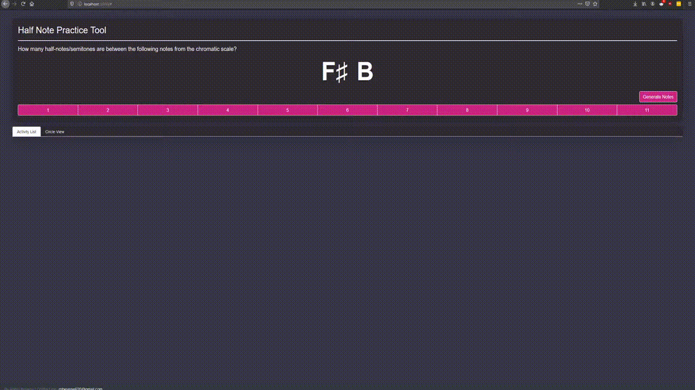

# Hexatone: Music Intervals Generator
A simple practice tool for counting the number of semitones (half notes) between two given notes. Developed with Node.js and Express.

<!-- Future plans: Showing notes in chromatic circle. Expand to provide more beginner music theory tools
Short demo: https://youtu.be/YgstxuuK9Fw -->

## Demo
Visit https://youtu.be/YgstxuuK9Fw to see a full demo video.

## Usage

1. Clone this repository.
2. Run `npm i` to install dependencies.
3. Run `npm start` to launch the server.
4. Navigate to `localhost:3000` to try out the app!
